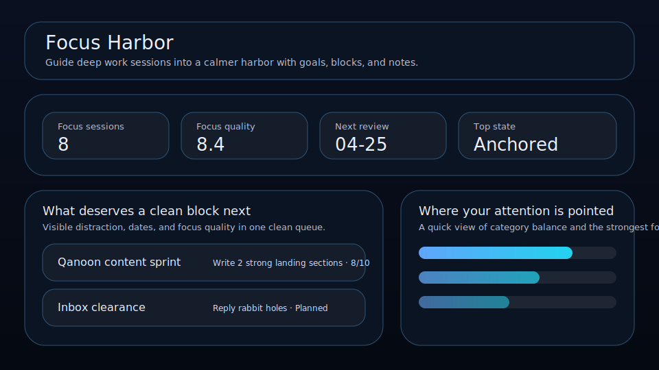

# Focus Harbor

Guide deep work sessions into a calmer harbor with goals, blocks, and notes.



Focus Harbor is a local-first workspace for founders, operators, and solo builders who want a cleaner way to manage focus sessions. It keeps focus quality, goal, distraction, and review timing visible so the right things move forward with less drift.

## What it does

- ranks focus sessions by leverage, focus quality, timing, and friction
- tracks **goal**, **distraction**, **session date**, and **focus quality** for each focus session
- highlights the best current bet, the next review slot, and the strongest signal on the board
- renders a dedicated queue plus a category mix snapshot beneath the main board
- saves locally in the browser with JSON import/export backups
- quick action: **Anchor session**
- quick action: **Improve focus**
- quick action: **Log session**

## Why it feels different

Focus Harbor is not just a generic list. It is shaped around the real workflow behind focus sessions, so the board helps you decide what matters next instead of simply storing records.

## Quick start

```bash
git clone https://github.com/get2salam/focus-harbor.git
cd focus-harbor
python -m http.server 8000
```

Then open <http://localhost:8000>.

## Local verification

Run the same focused checks used by CI before opening a PR:

```bash
npm run verify
```

This executes the scoring regression tests, syntax-checks the browser entry point, and confirms the HTML still exposes the data hooks that `js/main.js` needs to boot the app.

## Runnable scoring example

Preview how Focus Harbor turns a few sessions into a ranked queue without opening the browser:

```bash
npm run example:score
```

The example uses the same shared scoring helpers as the app, normalizes three sample focus sessions, then prints their priority order. It is useful when tuning focus quality, drag, and due-date behavior because the command is also covered by `npm run verify`.

## Keyboard shortcuts

- `N` creates a new focus session
- `/` focuses the search box

## Privacy

Everything stays in your browser unless you export a JSON backup.

## License

MIT
